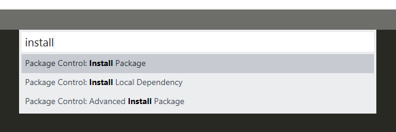
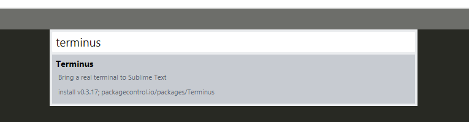

# sublime-python-terminal
Method for creating a build system that uses Terminus in Sublime to run Python code. This system runs python code through the command line, allowing you to give inputs to the code.

**Table of Contents**

* [Installing Package Controller and Terminus](#package-controller)
* [Creating Keybinds](#keybinds)
* [Creating New Build System](#build)
* [Using the New Build System](#usage)
* [Disclaimer](#disclaimer)

## Installing Package Controller and Terminus ##

* To begin you will need to install Package Controller, if you already have it installed skip this step.

To install, open up Sublime and click on Tools. At the bottom of the dropdown list select `Install Package Control...`

* Next you will need to install Terminus, if you already have it installed skip this step.

With Package Controller installed open the command pallete using Ctrl + Shift + P and search for `install`. Select the option that says `Package Control: Install Package`.

In the next window search for `Terminus` and select it to install.

* You may have to close and reopen Sublime a couple of times for Terminus to work properly, if you are not able to complete the next few steps try closing Sublime and reopening it again.

## Creating Keybinds ##

* You will need to create some keybinds to effeciently close and open the console when working on code.

To do this open the command pallete using Ctrl + Shift + P and search for `Terminus Key Bindings` and open the preferences file.

This will open a window similar to the one below:

* Next you need to add the new key bindings to the file.

Open the [key bindings file](keybindings.json) and copy the contents into the file on the right then save it.

It should now look like this:

* Finally you can close this window. If you wish you can also change the keys that the commands are mapped to.

## Creating New Build System ##

* Next you have to make a new build system that uses Terminus.

Open the Tools dropdown menu and hover over `Build System`. Select `New Build System...` at the bottom.

* Next add the data for the build.

Open the [build file](build.json) and copy the contents into the file then save it (you can choose what to call it).

The file should now look like this:

* Finally you need to set it as your build system.

If you use multiple build systems then keep your `Tools -> Build System` set to `Automatic` and select the `Tools -> Build With` option. In the menu that follows select the build system that you have just created.

If you will only use the new python build system you can set it as your build system in the `Tools -> Build System` menu.

## Using the New Build System ##

While editing a python file you can now press Ctrl + B to run the code. Press Escape, Ctrl + B or Ctrl + W to close the terminal.

You can also use Alt + \` to open the terminal from the file's location.

## Disclaimer ##

- When using the build it may create a folder called `__pycache__` in the running file's location. If you know of method that avoids this, let me know in the discussions page :)

- I have not extensively tested this build. If you encounter any problems please comment on the discussions page and I will see what I can do to help.

- I was only able to test this on a Windows 10 however I believe it may work on other operating systems.
